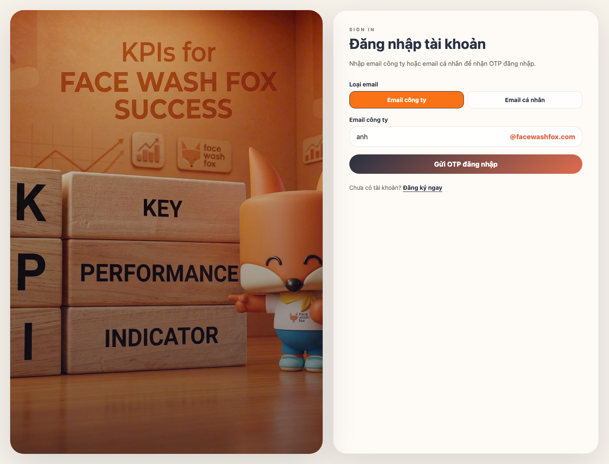
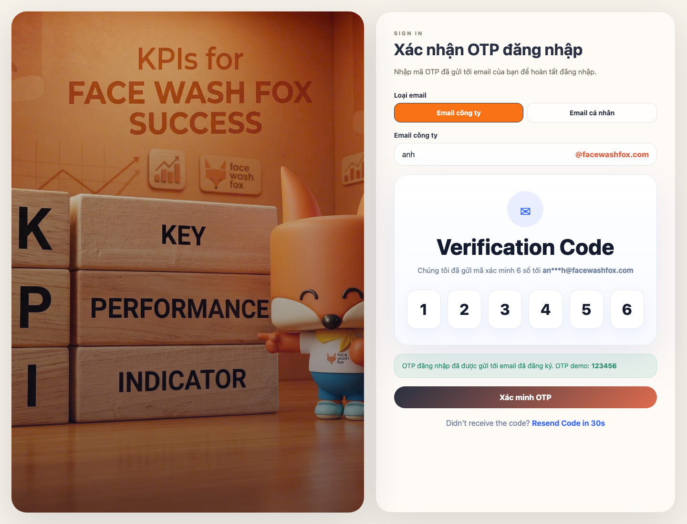
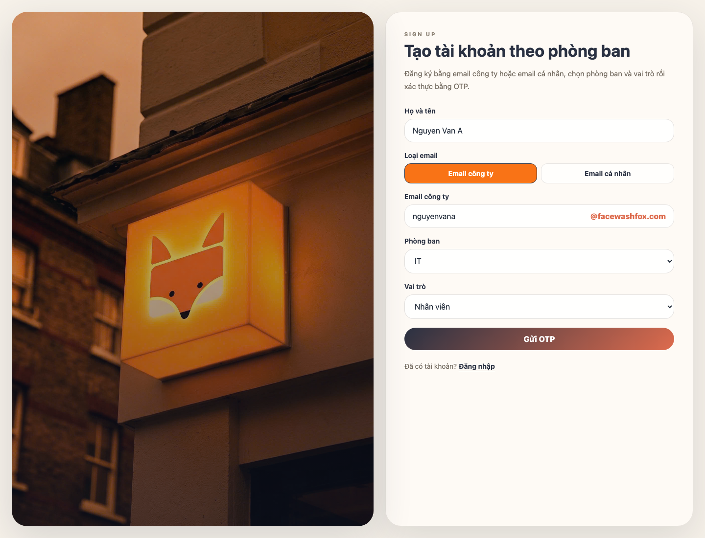
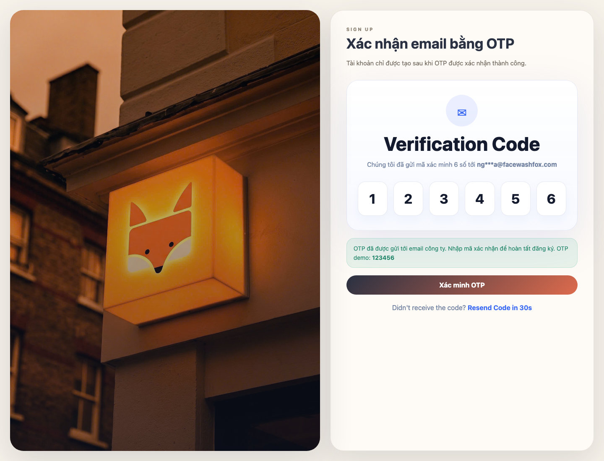
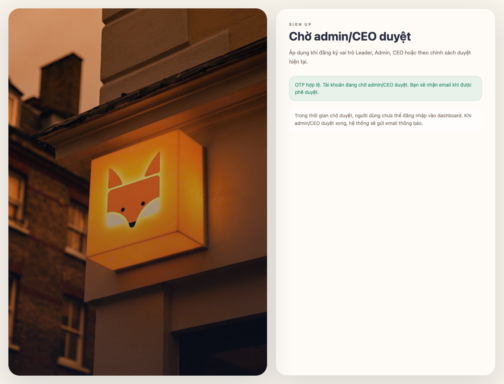

# Hướng dẫn đăng ký và đăng nhập FWF KPI

Tài liệu này mô tả luồng đăng ký và đăng nhập hiện tại của project FWF KPI. Hệ thống không dùng mật khẩu ở màn hình đăng nhập/đăng ký mới; người dùng xác thực bằng mã OTP 6 số gửi qua email.

## 1. Chuẩn bị trước khi thao tác

- Truy cập app tại `/login` để đăng nhập hoặc `/register` để đăng ký.
- Có thể dùng `Email công ty` dạng `ten@facewashfox.com` hoặc `Email cá nhân`.
- OTP có hiệu lực trong 5 phút.
- Sau khi gửi OTP, nút gửi lại sẽ bị khóa 30 giây.
- Nếu môi trường chưa cấu hình SMTP thật, server cần bật `OTP_DEBUG=true`; frontend muốn hiện OTP demo cần bật `NEXT_PUBLIC_OTP_DEBUG=true`.

## 2. Đăng nhập

### Bước 1: Mở màn hình đăng nhập

Vào `/login`. Chọn loại email rồi nhập email đã có tài khoản trong hệ thống.

Với `Email công ty`, người dùng chỉ cần nhập phần trước `@facewashfox.com`; hệ thống tự gắn domain công ty. Với `Email cá nhân`, nhập đầy đủ địa chỉ email.

### Bước 2: Gửi OTP đăng nhập

Nhấn **Gửi OTP đăng nhập**. Hệ thống chỉ gửi OTP nếu:

- Email đã tồn tại trong bảng người dùng.
- Tài khoản đã được xác minh.
- Tài khoản không đang ở trạng thái chờ admin/CEO duyệt.

Các lỗi thường gặp:

- `Không tìm thấy tài khoản phù hợp.`: email chưa có tài khoản.
- `Tài khoản chưa xác minh email bằng OTP.`: tài khoản chưa hoàn tất xác minh.
- `Tài khoản đã xác thực OTP và đang chờ admin gốc duyệt.`: tài khoản cần đợi phê duyệt.
- `Chưa cấu hình SMTP để gửi OTP thật.`: môi trường chưa có SMTP và không bật debug OTP.

### Bước 3: Nhập OTP

Nhập đủ 6 số OTP đã nhận qua email, sau đó nhấn **Xác minh OTP**.

Nếu OTP đúng và còn hạn, hệ thống tạo session rồi chuyển người dùng vào `/dashboard`. Nếu OTP sai hoặc hết hạn, màn hình sẽ báo lỗi và người dùng cần nhập lại hoặc gửi lại OTP.

## 3. Đăng ký tài khoản

### Bước 1: Mở màn hình đăng ký

Vào `/register`. Nhập họ tên, chọn loại email, nhập email, chọn phòng ban và vai trò.

Quy tắc chọn vai trò:

- Các phòng ban văn phòng có các vai trò: `Nhân viên`, `Leader`, `CEO`, `Admin`.
- Khi chọn `CEO`, phòng ban hiệu lực được đặt là `Vận hành`.
- Phòng ban `Cửa hàng` chỉ dùng các vai trò cửa hàng: `Trainer`, `Quản lí cửa hàng`, `Cửa hàng trưởng`, `Kỹ thuật viên`.

### Bước 2: Điền thông tin riêng cho phòng ban Cửa hàng

Nếu chọn phòng ban `Cửa hàng`, form sẽ hiện thêm trường theo vai trò.

Quy tắc hiện tại:

- `Trainer`: không cần chọn khu vực hoặc chi nhánh.
- `Quản lí cửa hàng`: chọn `Khu vực`; hệ thống gán toàn bộ chi nhánh thuộc khu vực đó.
- `Cửa hàng trưởng`: chọn `Khu vực` và đúng 1 `Chi nhánh`.
- `Kỹ thuật viên`: chọn `Cửa hàng trưởng quản lý`; nếu chưa có cửa hàng trưởng khả dụng, hệ thống dùng `Trainer` làm quản lý tạm thời.

### Bước 3: Gửi OTP đăng ký

Nhấn **Gửi OTP**. Hệ thống kiểm tra:

- Họ tên không được trống.
- Email chưa tồn tại.
- Email không đang có yêu cầu duyệt pending.
- Vai trò cửa hàng chỉ được dùng với phòng ban `Cửa hàng`.
- Thông tin khu vực, chi nhánh hoặc quản lý cửa hàng phải hợp lệ theo vai trò.

Nếu hợp lệ, hệ thống tạo OTP 6 số và gửi tới email.

### Bước 4: Xác nhận OTP đăng ký

Nhập OTP rồi nhấn **Xác minh OTP**.

Nếu vai trò không cần duyệt, hệ thống tạo tài khoản, tạo/cập nhật hồ sơ nhân sự tương ứng và đăng nhập người dùng vào dashboard.

Nếu OTP sai hoặc hết hạn, hệ thống hiển thị lỗi:

- `OTP không chính xác.`
- `OTP đã hết hạn. Vui lòng gửi lại OTP.`
- `Không tìm thấy yêu cầu xác minh phù hợp.`

## 4. Trường hợp cần admin/CEO duyệt

Theo logic server hiện tại, các vai trò sau cần duyệt sau khi xác minh OTP:

- `Leader`
- `Admin`
- `CEO`

Sau khi OTP hợp lệ, tài khoản chưa đăng nhập ngay mà chuyển sang trạng thái chờ duyệt.

Người dùng cần chờ admin/CEO duyệt. Sau khi được duyệt, hệ thống gửi email thông báo và người dùng có thể quay lại `/login` để đăng nhập bằng OTP.

## 5. Ghi chú vận hành

- API gửi OTP đăng nhập: `POST /api/auth/login`
- API xác minh OTP đăng nhập: `POST /api/auth/login/verify-otp`
- API gửi OTP đăng ký: `POST /api/auth/register/request-otp`
- API xác minh OTP đăng ký: `POST /api/auth/register/verify-otp`
- Component giao diện chính: `components/auth-shell.tsx`
- Provider gọi API auth: `components/auth-provider.tsx`
- Logic server tạo/xác minh OTP: `lib/server/data.ts`
- Cấu hình gửi email OTP: `lib/server/mailer.ts`

## 6. Checklist nhanh cho người dùng

Đăng ký:

1. Vào `/register`.
2. Nhập họ tên.
3. Chọn loại email và nhập email.
4. Chọn phòng ban, vai trò và thông tin cửa hàng nếu có.
5. Nhấn **Gửi OTP**.
6. Nhập OTP 6 số.
7. Nếu tài khoản cần duyệt, chờ admin/CEO duyệt trước khi đăng nhập.

Đăng nhập:

1. Vào `/login`.
2. Chọn loại email và nhập email đã đăng ký.
3. Nhấn **Gửi OTP đăng nhập**.
4. Nhập OTP 6 số.
5. Nhấn **Xác minh OTP** để vào dashboard.
